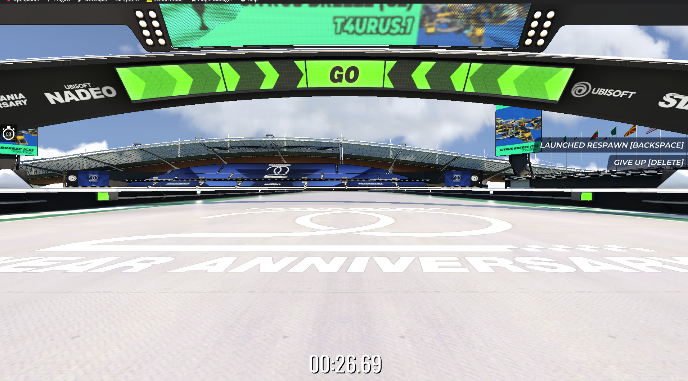
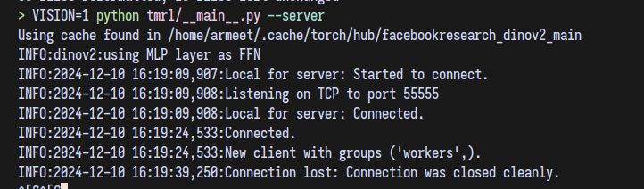
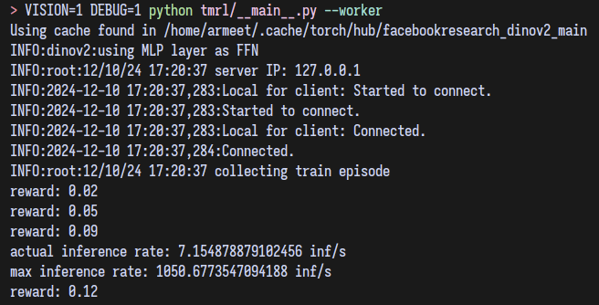
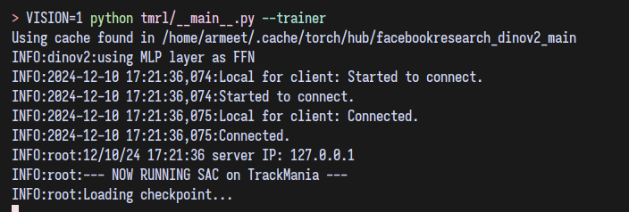

# ASAC for Racing

## Contents
- [ASAC for Racing](#asac-for-racing)
  - [Contents](#contents)
  - [Demos](#demos)
    - [Trained Autonomous Racing Models](#trained-autonomous-racing-models)
    - [Exploration: SAC for Double-Inverted Pendulum](#exploration-sac-for-double-inverted-pendulum)
    - [Exploration: YOLO segmentation](#exploration-yolo-segmentation)
    - [Exploration: YOLOP Driveable Area Segmentation](#exploration-yolop-driveable-area-segmentation)
  - [Structure](#structure)
  - [Guide](#guide)
    - [Environment Setup](#environment-setup)
    - [Checkpoints](#checkpoints)
    - [Weights \& Biases](#weights--biases)
    - [Training Model](#training-model)

## Demos

### Trained Autonomous Racing Models
- https://youtu.be/WTqHnXXDCMM
- https://youtu.be/Gh_ICtaGQOE
- https://youtu.be/lPaqiCn0ks0
- https://youtu.be/a5rasInTcpY
- https://youtu.be/lOSnBmLKBeg
- https://youtu.be/Zj_YYC4_8eI

### Exploration: SAC for Double-Inverted Pendulum
`explorations/toy_sac`

Full repo [gh/armeetj/sac-pendulum](https://github.com/armeetj/sac-pendulum)


https://github.com/user-attachments/assets/8a95bb82-0e4c-4296-a050-814929aa3f20


https://github.com/user-attachments/assets/d70811ca-e7ba-4bd9-a8f8-0a89237f166b


### Exploration: YOLO segmentation
`explorations/yolo`

https://youtu.be/MXsi_27mi5k


### Exploration: YOLOP Driveable Area Segmentation
`explorations/yolop`

## Structure

This is a mono-repo that consolidates the Trackmania gym implementation, our
custom ASAC implementation and vision models (DINO + YOLO), and side-explorations
(inverted-double-pendulum toy SAC). We also include the code to generate important
figures.

```bash
[ 44K]  .
├── [ 16K]  explorations
│   ├── [4.0K]  toy_sac - SAC from scratch for inverted double pendulum
│   └── [4.0K]  yolo - YOLO vision demos (segmentation / masking)
├── [4.0K]  figs - important fig generation
└── [ 20K]  tmrl - modified TMRL lib
    ├── [4.0K]  config
    ├── [4.0K]  custom - custom models, algs, vision models (DINO + YOLO)
    ├── [4.0K]  __pycache__
    └── [4.0K]  tools

  44K used in 10 directories
```

## Guide

To recreate our results, follow this guide step by step. You will need access to a Linux system with x86 architecture that can install Steam.
Additionally, you will need to purchase a paid license of Trackmania Club ($20/yr). Without this, the OpenPlanet API cannot access game internal state.

### Environment Setup

1. clone this repository locally
2. install `uv` which is the recommended method to setup the python environment.
   1. for linux the command should be: `curl -LsSf https://astral.sh/uv/install.sh | sh`
   2. for an up to date guide [click here](https://docs.astral.sh/uv/getting-started/installation/)
3. in the locally cloned repository, run `uv venv`, which will create a python virtual environment
4. run `uv python install 3.11` to install the correct python version
5. then run `source .venv/bin/activate` to activate the virtual environment
6. then, run `uv pip install -r requirements.txt` to install all required packages
7. to install any additional packages as needed, run `uv pip install pkg_name...`
8. install Trackmania, setup TMRL with OpenPlanet by following [this guide.](docs/INSTALL_LINUX.md)
9. purchase Trackmania Club membership and login
10. type F3 to open the OpenPlanet menu, then click "OpenPlanet" in top right, and set signature mode to "Developer." This is required to authorize data-grabbing plugins.
11. In the main menu, click "Play" -> "My Local Tracks" -> "My Maps" -> "TMRL-Train"
12. If a map editor shows up, click the green flag to begin playing the map.
13. By default the game starts in third person view. Switch POV mode to first person. The game should look like this, with the car's body hidden. You may need to navigate to settings (Esc -> settings -> keybinds) to find this.


14. This final step is VERY IMPORTANT! We train our models for a specific img resolution, so failing to change these numbers will result in faulty behavior. Modify these `/TmrlData/config/config.json` config fields to use these resolution numbers...
```json
{
    ...
    "WINDOW_WIDTH": 512,
    "WINDOW_HEIGHT": 256,
    "IMG_WIDTH": 168,
    "IMG_HEIGHT": 168,
    "IMG_GRAYSCALE": true,
    ...
}
```

### Checkpoints

Training can take upwards of a week, so we've provided pretrained checkpoints and 
pre-recorded reward function map checkpoints so you don't have to record them on your own.

Note that these map checkpoints are used to calculate the reward function, and 
only work on this one map. To train on alternative maps, you would have to re-record the reward function with `python tmrl/__main__.py --record-reward`.

Copy the `TmrlData` folder [here](https://drive.google.com/drive/folders/1tdQSbDuNYWaP6oZDhkxbKmhk_I9qHWa1?usp=sharing) into your own `/TmrlData` folder, overwriting its previous (mostly empty) contents.

### Weights & Biases

We recommend setting up weights and biases. The easiest way to do this is to...

1. open `/TmrlData/config/config.json`
2. add your WANDB apy key to the `WANDB_KEY` config field

### Training Model

1. navigate to the locally cloned repository
2. Follow the environment setup (above) and checkpoints setup (above). The car should be driveable.
3. In `/TmrlData/config/config.json`, modify the run_name to a new name (if training from scratch) or the name of one of the pretrained checkpoints.
4. Run the server
```bash
VISION=1 python tmrl/__main__.py --server
```


5. Run the worker. This controls the window, getting observations and sending inputs to the game window.
```bash
VISION=1 DEBUG=1 python tmrl/__main__.py --worker
```


6. Run the trainer, which receives batches from the server and trains the PyTorch models. To enable wandb logging, add the `--wandb` flag at the end. We recommend this to view metric/system performance plots during training.
```bash
VISION=1 python tmrl/__main__.py --trainer
```
or with wandb (if you setup Weights & Biases)...
```bash
VISION=1 python tmrl/__main__.py --trainer --wandb
```



You're done! Watch the plots on WANDB or monitor TrackMania to see the car learn to drive!